## Prerequisites  

- [Created Your First App using SAP BTP SDK Wizard for Android](cp-sdk-android-wizard-app)

## You will learn  

- Add App Link to your Android Application
- Host an `Assets.json` File using SAP Mobile Services

---

[ACCORDION-BEGIN [Step 1: ](Real world use case)]


As a Vendor Manager, you oversee a web and mobile application that enables you to view, manage, and order products from vendors. When a vendor adds a new product using the web app, they notify you via email, providing a web app link to the newly added product for your approval.

As you primarily use the mobile application, you want to click on the link to open the product detail page on your application and perform the necessary action.

*This tutorial, will help you configure [App Links](https://developer.android.com/studio/write/app-link-indexing) on Android, thereby eliminating the need for the user to manually navigate to the product page. Click [here](https://help.sap.com/doc/f53c64b93e5140918d676b927a3cd65b/Cloud/en-US/docs-en/guides/features/application-links/admin/universal-links.html) to learn more about universal links on SAP BTP SDK Android.*

[DONE]
[ACCORDION-END]

[ACCORDION-BEGIN [Step 2: ](Launch App Links Assistant)]

1. Open your Android Studio project.

2. Select Tools &rarr; **App Links Assistant** in the menu bar.

    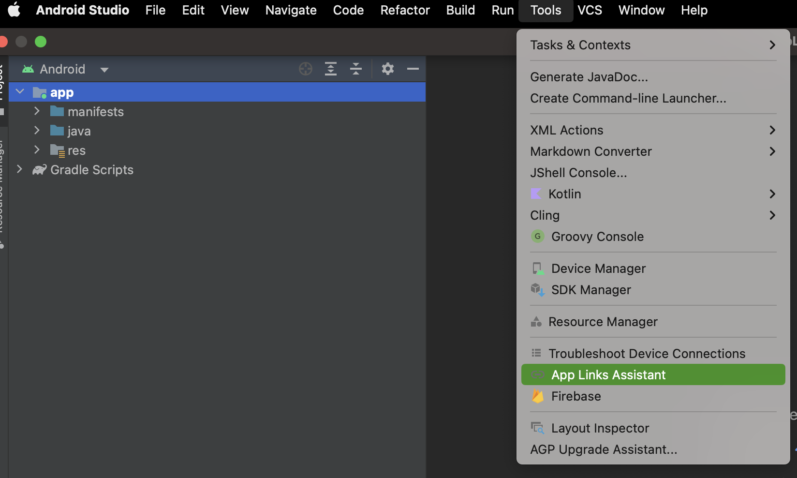

[VALIDATE_2]
[ACCORDION-END]

[ACCORDION-BEGIN [Step 3: ](Add URL intent filters)]

1. Click **Open URL Mapping Editor** in the App Links Assistant window.

2. Click **+** to add a new URL mapping.

    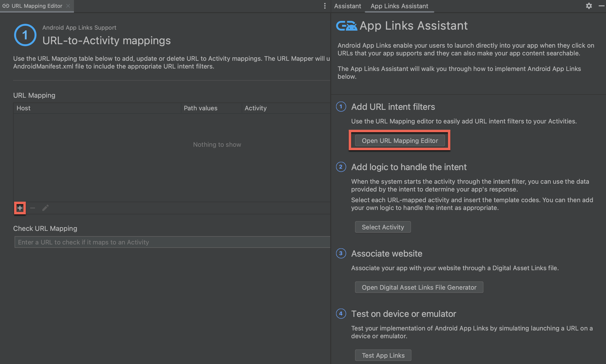

3. Open **SAP Mobile Services** admin UI.

4. Click **Mobile Applications &rarr; Native/MDK** in the sidebar.

5. Click on your app (For example `com.native.links`).

    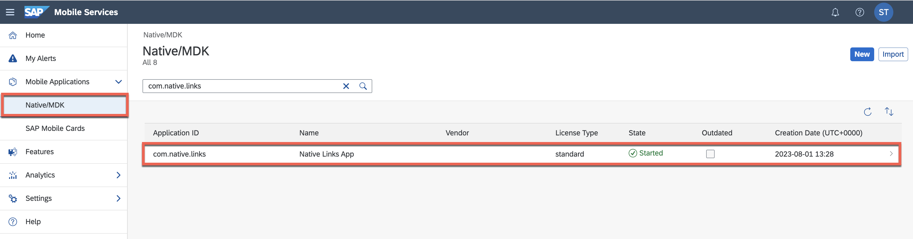

6. Click **APIs** tab.

7. Copy the **Server** URL.

    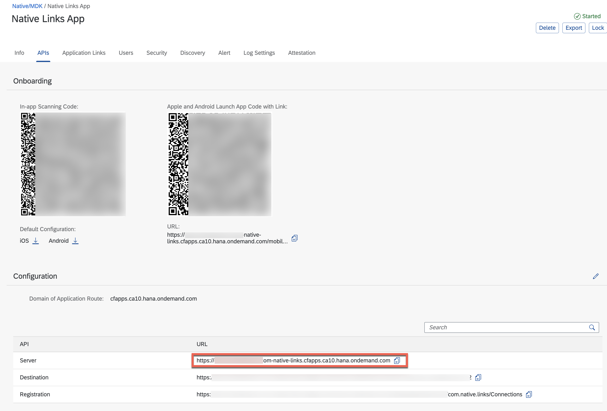

8. Use the following table to fill the details requested in the **Add URL Mapping** window, and click **OK**.

    | Field Name | Value | Details |
    |----|----|----|
    | Host | `<Server URL>` | |
    | Path | `pathPrefix` | From the drop-down menu |
    | Path - `pathPrefix` | `/data` | You can add any prefix |
    | Activity | `.ui.WelcomeActivity` | You can select any activity. The application in the tutorial has been created using `Jetpack Compose-based UI` 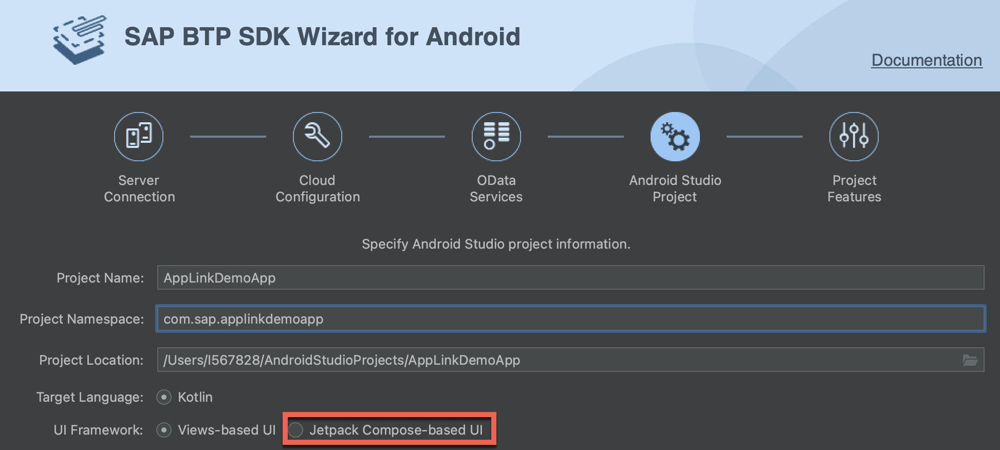 |

    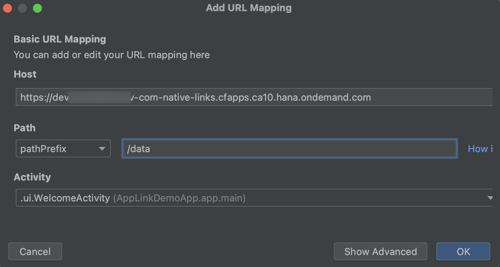

    > The required code is added to the `AndroidManfifest.xml` file.

9. Paste the following URLs in the **Check URL Mapping** input field to test if the URL will be handled by the app.

    | URL | Status |
    |----|----|----|
    | `<Server URL>` | *This URL doesn't map to any Activity.* |
    | `<Server URL>/data` | *This URL maps to any `.ui.WelcomeActivity`* |

[DONE]
[ACCORDION-END]

[ACCORDION-BEGIN [Step 4: ](Add logic to handle the intent)]

1. Select Tools &rarr; **App Links Assistant** in the menu bar of your Android Studio project.

2. Click **Select Activity** in the App Links Assistant window.

3. Select **`.ui.WelcomeActivity`** in the pop-up, and click **Insert Code**.

    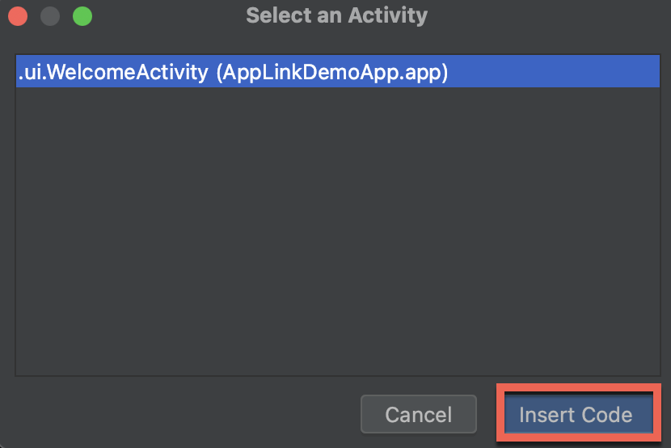

4. Open `WelcomeActivity.kt`.

5. Locate the inserted code block.

    ```kotlin
    // ATTENTION: This was auto-generated to handle app links.
    val appLinkIntent: Intent = intent
    val appLinkAction: String? = appLinkIntent.action
    val appLinkData: Uri? = appLinkIntent.data
    ```

6. Add the following code after the inserted code block.

    ```kotlin
    appLinkData?.let { uri ->
            val pathSegments: List<String> = uri.pathSegments

            if (pathSegments.isNotEmpty()) {
                val lastPathSegment: String = pathSegments.last()

                if (lastPathSegment == "product") {
                    Toast.makeText(this, "Product App Link", Toast.LENGTH_SHORT).show()
                } else if (lastPathSegment == "vendor") {
                    Toast.makeText(this, "Vendor App Link", Toast.LENGTH_SHORT).show()
                }
            }
    }
    ```

    > Ensure that the necessary libraries are imported.

[DONE]
[ACCORDION-END]

[ACCORDION-BEGIN [Step 5: ](Generate assets for web association)]

1. Select Tools &rarr; **App Links Assistant** in the menu bar of your Android Studio project.

2. Click **Open Digital Asset Links File Generator** in the App Links Assistant window.

3. Leave the default settings, and click **Generate Digital Asset Links file**.

    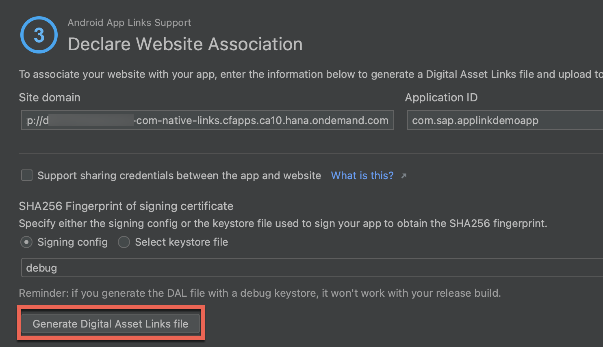

    > For productive apps, you must select the same certificate that will be used to sign the `.apk` file.

4. Click **Link and Verify**.

   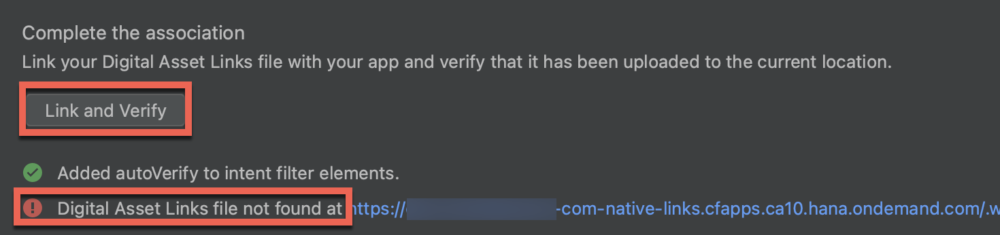

5. Copy the text under the **Preview** section.

    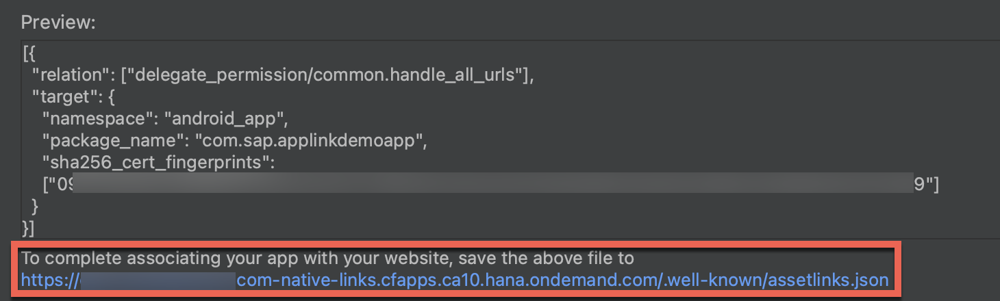

[DONE]
[ACCORDION-END]

[ACCORDION-BEGIN [Step 6: ](Add web association on Mobile Services)]

1. Open **SAP Mobile Services** admin UI.

2. Click **Mobile Applications &rarr; Native/MDK** in the sidebar.

3. Click on your app (For example `com.native.links`).

4. Click **Application Links** tab.

5. Click on the pencil next to the **Android App Links** section.

    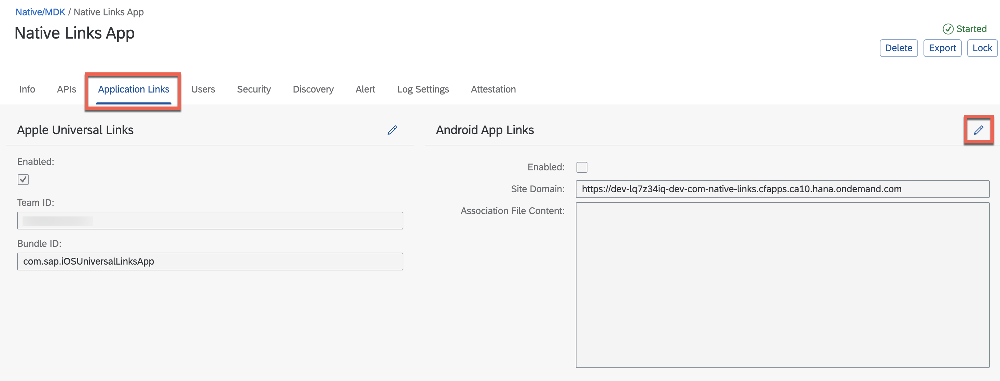

6. Use the following table to fill the details requested in the *Edit Apple Universal Links* form, and click **OK**.

    | Field Name | Value | Details |
    |----|----|----|
    | Enabled | Checked | |
    | Site Domain | `<Server URL>` | This field is not editable. |
    | Association File Content | `<Website Association>` | Text copied in the previous step |

    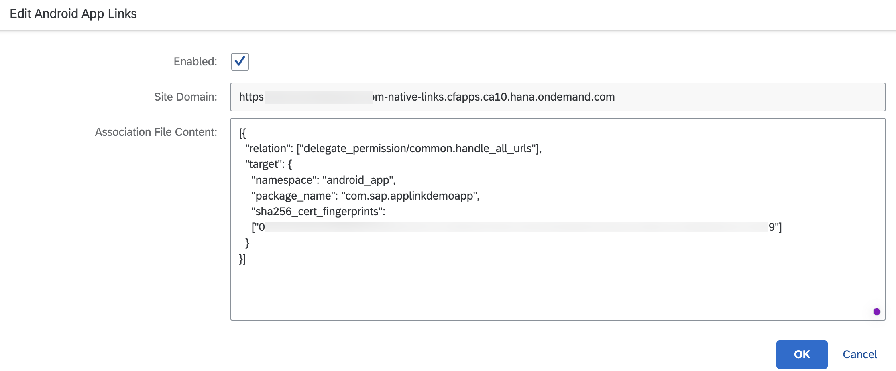

[DONE]
[ACCORDION-END]

[ACCORDION-BEGIN [Step 7: ](Check the asset links file on Mobile Services)]

1. Click **APIs** tab.

2. Copy the **Server** URL.

3. Open a new browser window.

4. Paste the **Server** URL and add the suffix `/.well-known/assetlinks.json`.

    >  The URL should look like `https://<YourUser-CFSpace-App>-com-example-tutorialapp.cfapps.eu10.hana.ondemand.com/.well-known/assetlinks.json`

5. Go the above constructed URL.

    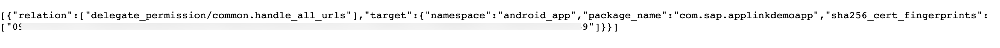

    > The Asset Links file is a JSON file on the web server of the associated domain. When a user clicks an App Link (web page link), Android checks for the `assetlinks.json` file. If found and configured correctly, Android opens the native app instead of the web page in the browser.

[VALIDATE_7]
[ACCORDION-END]

[ACCORDION-BEGIN [Step 8: ](Try the Android App Links)]

1. Click `▶` in Android Studio to run the application.

2. Complete the onboarding steps.

    > Please refer to the pre-requisite for a step by step guide for the onboarding flow.

3. Go to your **SAP Mobile Services** Admin UI.

4. Click on your app (For example `com.native.links`).

5. Click **APIs** tab.

6. Copy the **Server URL**.

7. Open the **Messages** App provided by Android on your Simulator/Device.

    > If the app is running on a real device, choose any option that hyperlinks the URL text, for example, Mail, Notes, Keep, etc.

8. Try the following links.

    | URL | Expected Behaviour |
    |----|----|
    | `server_url` | The OS tries to open the URL using the default browser. |
    | `server_url/data` | The OS launches the app. |
    | `server_url/data/product` | The OS launches the app and a toast message specific to products is shown. |
    | `server_url/data/vendor` | The OS launches the app and a toast message specific to vendors is shown. |
    | `server_url/product` | The OS tries to open the URL using the default browser.  |

    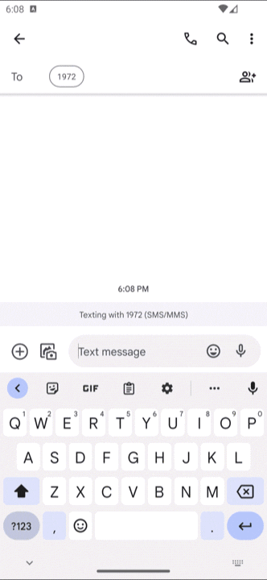

[DONE]
[ACCORDION-END]

Congratulations on successfully completing the tutorial. You can now configure universal links for your native applications built using SAP BTP SDK for Android.

---
