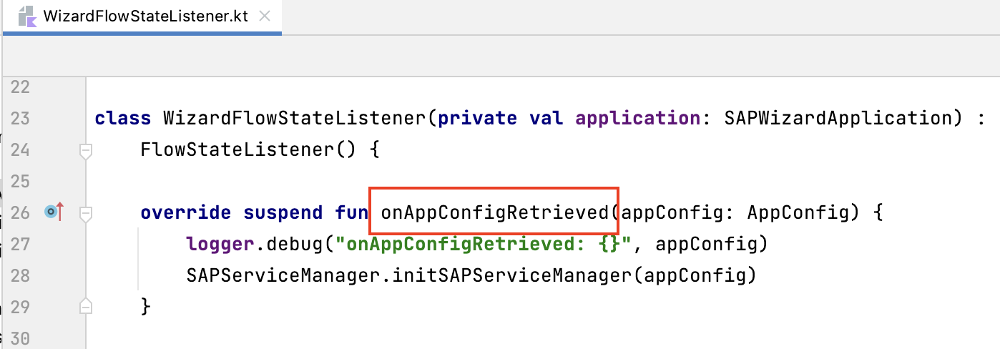
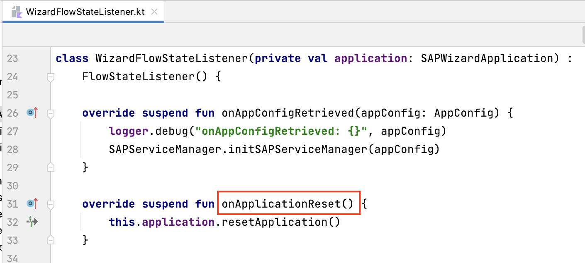
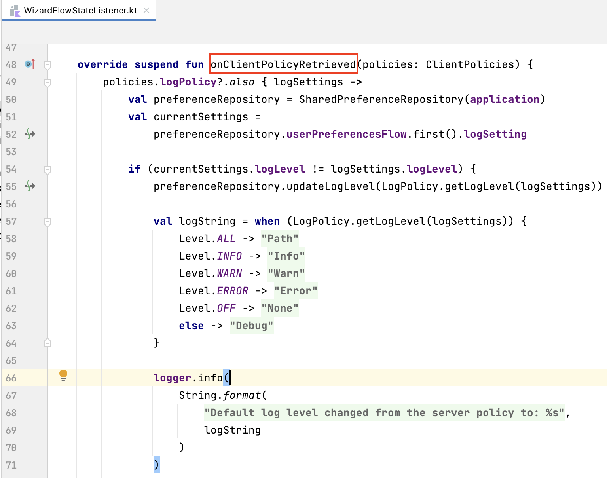
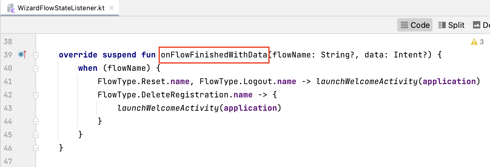

## Prerequisites
- You have [Set Up a BTP Account for Tutorials](group.btp-setup). Follow the instructions to get an account, and then to set up entitlements and service instances for the following BTP services.
    - **SAP Mobile Services**
- You completed [Try Out the SAP BTP SDK Wizard for Android](sdk-android-wizard-app).
- You completed [Offline-Enable Your Android Application](sdk-android-wizard-app-offline).
- You completed [ Get Familiar with Jetpack Compose Flows Component by a Wizard-Generated Application](sdk-android-flowsjc-wizard).

## Details
### You will learn
  - How to customize the UI screens for the Jetpack Compose onboarding flow
  - How to add your own logic by listening to the flow states
  - How to insert your own logic using the action handler

---

[ACCORDION-BEGIN [Step 1: ](Customize the UI screens for the Jetpack Compose onboarding flow)]

The onboarding flow is comprised of the following UI components:

-	End user license agreement (EULA) screen
-	Activation screen
-	Authentication screen
-	Set passcode and verify passcode screens
-	Usage consent screen and crash report consent screens.

The visibility and the content of each screen will vary depending on the different application configurations and client code customization.

1.  By default, the first screen of the onboarding flow is the EULA screen. This screen allows users to review and agree to the end user license agreement. To exclude this screen, set the value of **`useDefaultEulaScreen`** parameter to **`false`** for the **`FlowOptions`** instance and set this **`FlowOptions`** instance for the **`FlowContext`** instance to start the onboarding flow.

    ```Kotlin
    val flowContext = FlowContext(
        appConfig = appConfig,
        flowOptions = FlowOptions(
            useDefaultEulaScreen = false
    )
    FlowUtil.startFlow(activity, flowContext)
    ```

    Notice that if the EULA screen is excluded, it will be the responsibility of the client code to handle the end user license agreement.

2.  If the **`AppConfig`** instance in **`FlowContext`** does not provide the authentication info or host for the mobile application, the activation screen will be displayed to get the complete **`AppConfig`** from either the `Discovery Service`, `QR code scanning` or `MDM`. By default, the QR code scanning screen will be displayed. The client code can customize the screen to display other activation screens.

    Create a **`FlowOptions`** instance and set the value for **`activationOption`** parameter, **`ActivationOption.DS_ONLY`** value to display the `Discovery Service` method only, **`ActivationOption.MDM_ONLY`** value to display the `MDM` method only and **`ActivationOption.DS_OR_QR`** value to display the activation screen for selecting from both methods. Using the code snippet below, the activation screen will only display the option for Discovery Service.

    ```Kotlin
    val flowContext = FlowContext(
        appConfig = appConfig,
        flowOptions = FlowOptions(
            activationOption = ActivationOption.DS_ONLY
    )
    FlowUtil.startFlow(activity, flowContext)
    ```

    Notice that if the **`AppConfig`** instance contains complete information, the onboarding flow will skip the activation screen and go directly to the authentication step.


3.  After getting the complete application configuration, the onboarding flow will display different authentication screens based on the authentication type defined for the application. For example, a screen with user input for `User Name` and `Password` properties will be displayed if the authentication type is `Basic`. If the authentication type is `SAML`, the screen will redirect to a web page for user login. The logic to decide which authentication screen to display is built into the onboarding flow and the client code cannot change it.

4.  The set passcode and verify passcode screen will be skipped if a passcode policy is not enabled on the server side. Notice that in multi-user mode, the passcode step cannot be skipped and a default passcode policy will be created if it's not enabled on the server.

    Also, the usage consent screen will be skipped if usage reporting is not enabled and the crash report screen will be skipped if crash reporting is not enabled. Otherwise, the screens will be displayed in the  onboarding flow, and the client code cannot alter this fact. To enable the usage reporting and crash reporting services, the client code needs start them using the **`SDKInitializer`** class.

    ```Kotlin
    val services = mutableListOf<MobileService>()
    services.add(UsageService())
    services.add(CrashService())

    SDKInitializer.start(this, * services.toTypedArray())
    ```

5.  Besides the options to include or exclude a step, you can set the client code to customize screens using its  **`ScreenSettings`**, including the title, description, and button text for all screens. For some specific screens, such as the EULA screen, the client code can specify its own URL for the EULA file. See [Onboarding Compose Screens](https://help.sap.com/doc/f53c64b93e5140918d676b927a3cd65b/Cloud/en-US/docs-en/guides/features/onboarding/android/fiori-compose-screens/Overview.html) in the help documentation for information on the detailed settings for each screen in the onboarding process.

    To have the customized screen settings take effect in the onboarding flow, set the list of **`ScreenSettings`** for the **`FlowContext`** instance.

    ```Kotlin
    val customScreenSettings = CustomScreenSettings(
        eulaSettings = EulaScreenSettings(
            eulaUrl = "file:///android_asset/my_eula.html"),
        setPasscodeScreenSettings = SetPasscodeScreenSettings(
            description = R.string.set_passcode_screen_desc)
    )
    val flowContext = FlowContext(
        appConfig = appConfig,
        flowOptions = FlowOptions(
            screenSettings =  customScreenSettings
    )
    FlowUtil.startFlow(activity, flowContext)
    ```

[ACCORDION-END]

[ACCORDION-BEGIN [Step 2: ](Listen to the flow states)]

In this section, we explain the onboarding-related callbacks in **`FlowStateListener`** based on the **`WizardFlowStateListener`** class generated by the SAP BTP SDK Wizard for Android.

1.  Open the project you previously created using the SAP BTP SDK Wizard for Android.

2.  In Android Studio, on Windows, press **`Ctrl+N`**, or, on a Mac, press **`command+O`**, and type **`WizardFlowStateListener`** to open `WizardFlowStateListener.kt`.

3.  On Windows, press **`Ctrl+F12`**, or, on a Mac, press **`command+F12`**, and type **`onAppConfigRetrieved`** to move to the `onAppConfigRetrieved` method. The event is notified when the **`AppConfig`** instance is retrieved from either the Discovery Service or QR code scan. Client code can perform the initialization when the **`AppConfig`** is ready.

    !

    ```Kotlin
    override suspend fun onAppConfigRetrieved(appConfig: AppConfig) {
        logger.debug("onAppConfigRetrieved: {}", appConfig)
        SAPServiceManager.initSAPServiceManager(appConfig)
    }
    ```

4.  On Windows, press **`Ctrl+F12`**, or, on a Mac, press **`command+F12`**, and type **`onApplicationReset`** to move to the `onApplicationReset` method. The event is notified when reset the application by starting the `reset` flow.

    !

    ```Kotlin
    override suspend fun onApplicationReset() {
        this.application.resetApplication()
    }
    ```

5.  On Windows, press **`Ctrl+F12`**, or, on a Mac, press **`command+F12`**, and type **`onClientPolicyRetrieved`** to move to the `onClientPolicyRetrieved` method. After authentication is completed, the onboarding flow will get the client policies from the mobile server and then notify this event. The client code can then create the UI to display the settings.

    !

    ```Kotlin
    override suspend fun onClientPolicyRetrieved(policies: ClientPolicies) {
        policies.logPolicy?.also { logSettings ->
            val preferenceRepository = SharedPreferenceRepository(application)
            val currentSettings =
                preferenceRepository.userPreferencesFlow.first().logSetting

            if (currentSettings.logLevel != logSettings.logLevel) {
                preferenceRepository.updateLogLevel(LogPolicy.getLogLevel(logSettings))

                val logString = when (LogPolicy.getLogLevel(logSettings)) {
                    Level.ALL -> application.getString(R.string.log_level_path)
                    Level.INFO -> application.getString(R.string.log_level_info)
                    Level.WARN -> application.getString(R.string.log_level_warning)
                    Level.ERROR -> application.getString(R.string.log_level_error)
                    Level.OFF -> application.getString(R.string.log_level_none)
                    else -> application.getString(R.string.log_level_debug)
                }

                logger.info(
                    String.format(
                        application.getString(R.string.log_level_changed),
                        logString
                    )
                )

                MainScope().launch {
                    Toast.makeText(
                        application,
                        String.format(
                            application.getString(R.string.log_level_changed),
                            logString
                        ),
                        Toast.LENGTH_SHORT
                    ).show()
                }
            }
        }
    }
    ```

6.  On Windows, press **`Ctrl+F12`**, or, on a Mac, press **`command+F12`**, and type **`onFlowFinishedWithData`** to move to the `onFlowFinishedWithData` method. The flows framework will send this event to the client code when a flow finishes successfully and the flow activity is removed from the back stack. Notice that this callback will only be invoked when the flow is successfully completed. If at any time the flow is canceled, this callback will not be invoked.

    !

    ```Kotlin
    override suspend fun onFlowFinishedWithData(flowName: String?, data: Intent?) {
        when (flowName) {
            FlowType.Reset.name, FlowType.Logout.name -> launchWelcomeActivity(application)
            FlowType.DeleteRegistration.name -> {
                launchWelcomeActivity(application)
            }
        }
    }
    ```

7.  Besides the callbacks implemented in the **`WizardFlowStateListener`** class, the **`OkHttpClientReady`** method is also useful if you want to add an HTTP header into the **`onOkHttpClient`** instance. Before authentication, the **`OkHttpClient`** instance will be ready and sent to the client code using `onOkHttpClientReady`. To add your own HTTP header, override the **`OkHttpClientReady`** method in your flow state listener.

    ```Kotlin
    override fun onOkHttpClientReady(httpClient: OkHttpClient) {
        httpClient.addUniqueInterceptor( object: Interceptor {
            override fun intercept(chain: Interceptor.Chain): Response {
                val request: Request = chain.request()
                val newRequest = request.newBuilder()
                    .header("my_header", "my_header_value")
                    .build()
                return chain.proceed(newRequest)
            }
        })
    }
    ```

>Please see [Flows Extension Point](https://help.sap.com/doc/f53c64b93e5140918d676b927a3cd65b/Cloud/en-US/docs-en/guides/features/onboarding/android/newflows/ExtensionPoints.html) and [`FlowStateListener` in the Flows Component of SAP BTP SDK for Android](https://blogs.sap.com/2021/03/09/flowstatelistener-in-the-flows-component-of-sap-btp-sdk-for-android/) for detailed information on all of the flow states and callbacks. `FlowStateListener` has the same purpose as that in the view-based flows component and the sequence of the callback functions is also the same. The difference is that every callback function is marked as suspend, so it's easier for the client code to call other suspend functions.

[ACCORDION-END]

[ACCORDION-BEGIN [Step 3: ](Insert your own logic using action handler)]

The **`FlowActionHandler`** class allows you to insert your own logic at certain points in the onboarding flow, such as adding your own passcode validation or barcode validation after the default rules are executed, adding an algorithm for user name or email obfuscation when displaying the user information, or adding a parser for barcode content when scanning QR codes, etc.

Similar to the **`FlowStateListener`**, you need to extend the **`FlowActionHandler`** class to implement the corresponding methods and set your own **`FlowActionHandler`** instance for the **`FlowContext`** instance using the `FlowContext.setFlowStateListener(listener: FlowStateListener)` method.

This section provides some sample implementations for the methods in the **`FlowActionHandler`** class.

1.  The **`FlowActionHandler`** provides three methods related to passcode validation:

    **`open fun isPasscodeDigitOnly(): Boolean`**

    **`open fun isLocalizingPasscodeDigitsToLatin(): Boolean`**

    **`open fun validatePasscode(code: CharArray): Boolean`**

    The first two methods allow you to add additional rules for passcode policy and the last method is for you to add your own validation logic in addition to the rules defined in the passcode policy. For example, when the passcode policy allows special characters, you can still add the logic to disable certain special characters. For instance, the sample code below prevents the user from being able to use "@" as one of the possible special characters:

    ```Kotlin
    override fun validatePasscode(code: CharArray): Boolean {
        if(code.contains('@')) {
            return false
        }
        return super.validatePasscode(code)
    }
    ```

2.  The **`FlowActionHandler`** provides two methods related to the QR code:

    **`open fun validateBarcode(barcode: String): ServiceResult<Boolean>`**

    **`open fun parsingBarcode(barcode: String): AppConfig?`**

    The first method allows you to add customized validation logic and the second method allows the client code to parse the QR code and construct the **`AppConfig`** instance using its own logic.

    For example, you can specify that the QR code must contain some particular properties:

    ```Kotlin
    override fun validateBarcode(barcode: String): ServiceResult<Boolean> {
        return if (barcode != null && barcode.contains("AppId") && barcode.contains("ClientId")
                && barcode.contains("AuthorizationEndpointUrl")
                && barcode.contains("ServerUrl") && barcode.contains("RedirectUrl")
                && barcode.contains("TokenUrl")) {
            ServiceResult.SUCCESS(true)
        } else {
            ServiceResult.FAILURE("")
        }
    }
    ```

3.  The **`FlowActionHandler`** provides two methods related to handling the certificate:

    **`open fun getCertificateProvider(): CertificateProvider`**

    **`onCertificateSslClientAuthPrepared(): SslClientAuth?`**

    The first method allows you to provide a customized `CertificateProvider` for a certificate challenge and the second method allows you to provide your own `SslClientAuth` for certificate authentication.

    For example, you can create a **`SslClientAuth`** instance using a **`ChooseCertificateProvider`** instance to pop up a dialog for user to choose a certificate:

    ```Kotlin
    override fun onCertificateSslClientAuthPrepared(): SslClientAuth {
        val chooseCertificateProvider = ChooseCertificateProvider()
        return SslClientAuth(chooseCertificateProvider)
    }
    ```

4.  The **`FlowActionHandler`** provides two methods for user name and email obfuscation when displaying the information on the sign-in screen:

    **`open fun obfuscateUserName(name: String): String`**

    **`open fun obfuscateEmail(email: String): String`**

    For example, you can choose to not obfuscate the email but obfuscate the user name by keeping the first two characters and replacing the other characters with several "\_" characters:

    ```Kotlin
    override fun obfuscateEmail(email: String): String {
        return email
    }

    override fun obfuscateUserName(name: String): String {
        if (name.isEmpty()) {
            return name
        }
        return if (name.length > 2) {
            name.substring(0, 2) + "____"
        } else {
            name.substring(0, 1) + "_____"
        }
    }
    ```

5.  The **`FlowActionHandler`** provides a method for the client code to add "back button press" logic when a web view is displayed for authentication. For some authentication types, the onboarding flow will open a web view for authentication. You can add your own logic to specify what action is taken when the **`Back`** button of the web view is pressed.

    **`open fun webViewBackPressHandler(): IBackPress? = null`**

    The following sample code implements a warning dialog when the **`Back`** button is pressed:

    ```Kotlin
     override fun webViewBackPressHandler() = IBackPress {
        val activity = AppLifecycleCallbackHandler.getInstance().activity
        activity?.let {
            AlertDialog.Builder(activity)
                .setMessage("Are you sure you want to exit onboarding flow?")
                .setPositiveButton("OK") { dialog, _ ->
                    activity.finish()
                    dialog.dismiss()
                }.setNegativeButton("Cancel") { dialog, _ ->
                    dialog.dismiss()
                }.show()
        }
    }
    ```

6.  The **`FlowActionHandler`** provides a method for the client code to add custom steps for the onboarding flow. The client code can add its own steps to the supported insert points.

    **`open fun getFlowCustomizationSteps(flow: BaseFlow, insertionPoint: CustomStepInsertionPoint)`**

    Currently, the following insertion points are supported：

    ```Kotlin
    sealed class CustomStepInsertionPoint {
        object BeforeEula : CustomStepInsertionPoint()
        object BeforeActivation : CustomStepInsertionPoint()
        object BeforeAuthentication : CustomStepInsertionPoint()
        object BeforeSetPasscode : CustomStepInsertionPoint()
        object BeforeConsents : CustomStepInsertionPoint()
        object BeforeOnboardingFinish : CustomStepInsertionPoint()
    }
    ```

    The following sample code adds a welcome step before the EULA step for the onboarding flow：

    ```Kotlin
    override fun getFlowCustomizationSteps(
        flow: BaseFlow,
        insertionPoint: CustomStepInsertionPoint
    ) {
        if (flow.flowName == FlowType.Onboarding.name) {
            when (insertionPoint) {
                CustomStepInsertionPoint.BeforeEula -> {
                    flow.addSingleStep(step_welcome, secure = false) {
                        LaunchScreen(
                            primaryViewClickListener = {
                                flow.flowDone(step_welcome)
                            },
                            secondaryViewClickListener = {
                                flow.terminateFlow(Activity.RESULT_OK)
                            }
                        )
                    }
                }
                else -> Unit
            }
        }
    }
    ```

Congratulations! You have learned how to customize a Jetpack Compose onboarding flow!

[ACCORDION-END]
---
