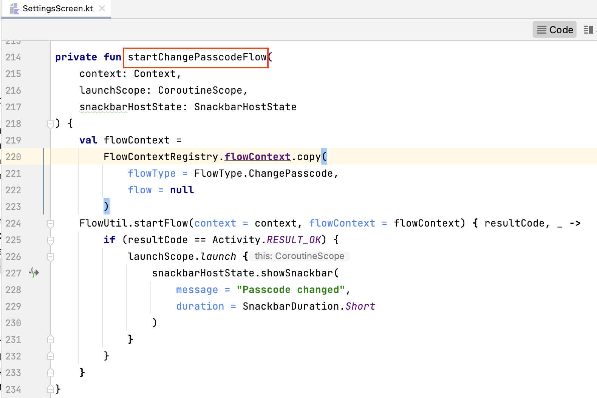
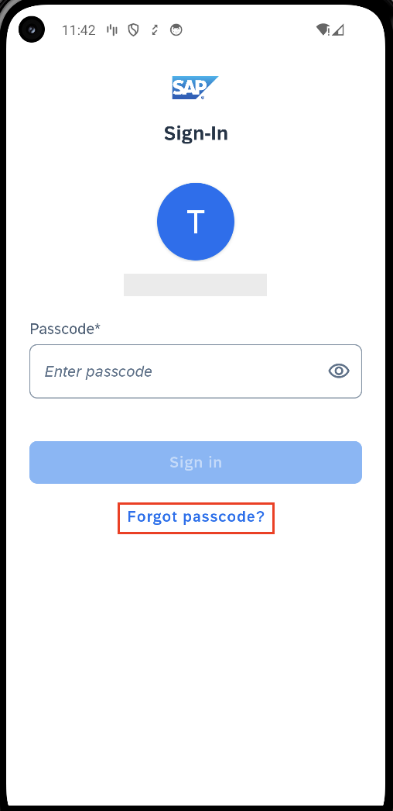

## Prerequisites
- You have [Set Up a BTP Account for Tutorials](group.btp-setup). Follow the instructions to get an account, and then to set up entitlements and service instances for the following BTP services.
    - **SAP Mobile Services**
- You completed [Try Out the SAP BTP SDK Wizard for Android](sdk-android-wizard-app).
- You completed [ Get Familiar with Jetpack Compose Flows Component by a Wizard-Generated Application](sdk-android-flowsjc-wizard).

## Details
### You will learn
  - How to change passcode in Jetpack Compose Flows component
  - How to handle the forgetting a passcode scenario in Jetpack Compose Flows component

---

[ACCORDION-BEGIN [Step 1: ](Handle a passcode change in the Jetpack Copmpose Flows component)]

1.  Open the project you [previously created](sdk-android-wizard-app) using the SAP BTP SDK Wizard for Android.

2.  In Android Studio, on Windows, press **`Ctrl+N`**, or, on a Mac, press **`command+O`**, and type **`SettingsScreen`** to open `SettingsScreen.kt`.

3.  On Windows, press **`Ctrl+F12`**, or, on a Mac, press **`command+F12`**, and type **`startChangePasscodeFlow`** to move to the `startChangePasscodeFlow` method. To start the flow to change a passcode, the flow type must be **`FlowType.ChangePasscode`** for the **`FlowContext`** instance. Upon starting the flow with this **`FlowContext`** instance, the entire process to change passcode will be handled automatically.

    !

4.  The change passcode flow will firstly display the sign-in screen for the user to input their current passcode. When sign-in is successful with correct passcode, a set passcode flow will be started and open "Create Passcode" and "Verify Passcode" screens for user to input and verify the new passcode. The subsequent step is optional, when biometric authentication is enabled in the passcode policy and is also supported on the device, the "Enable Biometric" screen will be displayed. The user can decide whether or not to enable biometric authentication for this app. Then the flow is finished and the new passcode will take effect.

    Notice that in the sign-in screen of a change passcode flow, the **FORGOT PASSCODE?** button is invisible and the **SWTICH OR ADD USER** button in multi-user mode is also invisible.

[ACCORDION-END]

[ACCORDION-BEGIN [Step 2: ](Handle forgetting passcode in Jetpack Compose Flows component)]

1.  In the app generated from the SAP BTP SDK Wizard for Android, there is a **FORGOT PASSCODE?** button on the sign-in screen. When the app is locked and the user forgot the passcode to unlock the app, user can click this button to start a forgot passcode flow and reset the passcode.

    !

2.  The forgot passcode flow actually starts an onboarding flow. The differences between a forgot passcode flow and a standard onboarding flow are:

    - It is only used internally by Jetpack Compose Flows component.

    - The EULA screen is always excluded in the forgot passcode flow.

    - The forgot passcode flow remembers the user ID that is performing the forgot passcode action and if the user tries to onboard with another user ID, the flow will terminate with a warning dialog.

    !

Congratulations! You now have learned how to handle your passcode using the Jetpack Compose Flows component!

[DONE]
[ACCORDION-END]

---
