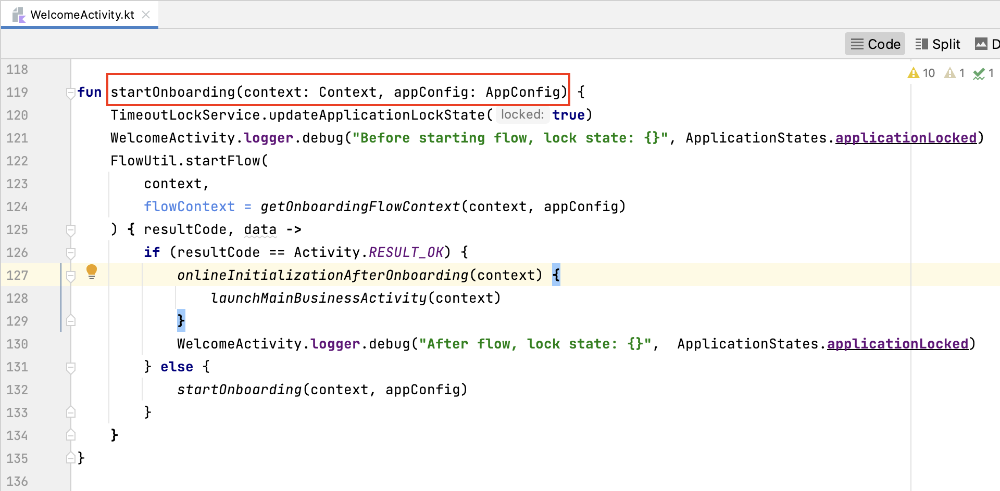
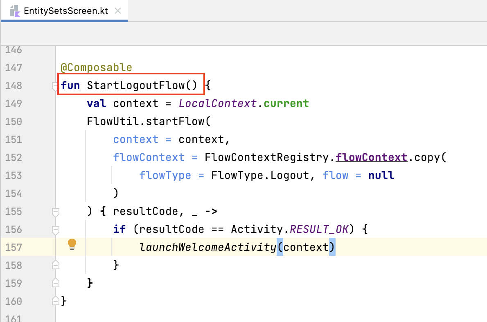
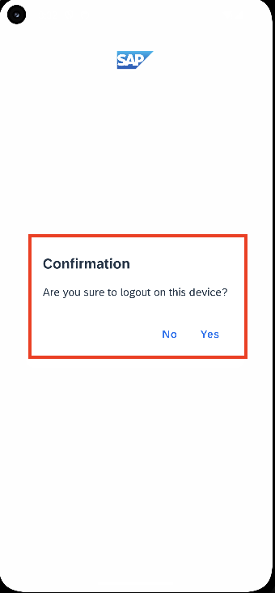
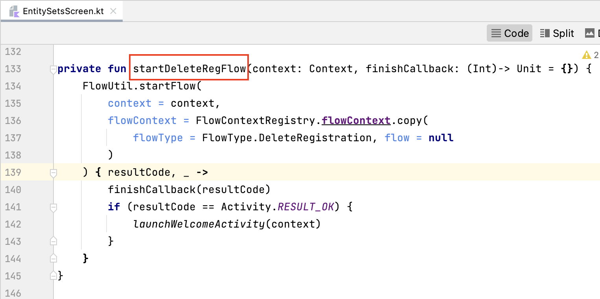
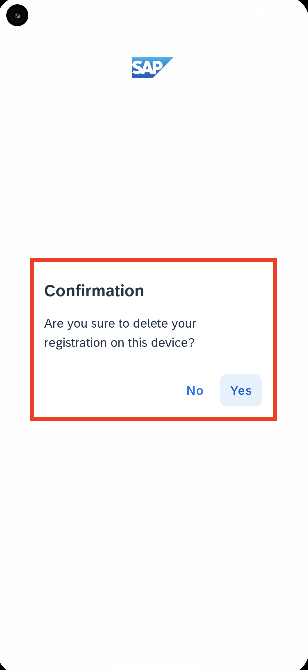

## Prerequisites
- You have [Set Up a BTP Account for Tutorials](group.btp-setup). Follow the instructions to get an account, and then to set up entitlements and service instances for the following BTP services.
    - **SAP Mobile Services**
- You completed [Try Out the SAP BTP SDK Wizard for Android](sdk-android-wizard-app).
- You completed [Get Familiar with Jetpack Compose Flows Component by a Wizard-Generated Application](sdk-android-flowsjc-wizard).
- You completed [Customize the Jetpack Compose Onboarding Flow](sdk-android-flowsjc-onboarding).

## Details
### You will learn
  - How to handle application restore and passcode timeouts using the Jetpack Compose Flows component
  - How to reset an application using the Jetpack Compose Flows component
  - How to log out of an application using the Jetpack Compose Flows component
  - How to delete the user registration of an application using the Jetpack Compose Flows component

---

[ACCORDION-BEGIN [Step 1: ](Application restore)]

After onboarding, the next time users open the mobile app, the restore flow will be started. Basically, the restore flow consists of the screen unlocking the app with either the passcode or biometric information, if enabled. The restore flow will also check whether the passcode is expired based on the setting defined in the passcode policy. If the passcode is expired, the restore flow will ask the user to create a new passcode and launch a change passcode flow.

Similar to the onboarding flow, the restore flow will also listen to the flow states and notify corresponding events to the client code.

The flows component will automatically determine whether to use the onboarding or restore flow, so the app can use the same client code for both flows.

1.  Open the project you [previously created](sdk-android-wizard-app) using the SAP BTP SDK Wizard for Android.

2.  In Android Studio, on Windows, press **`Ctrl+N`**, or, on a Mac, press **`command+O`**, and type **`WelcomeActivity`** to open `WelcomeActivity.kt`.

3.  On Windows, press **`Ctrl+F12`**, or, on a Mac, press **`command+F12`**, and type **`startOnboarding`** to move to the `startOnboarding` method. As we mentioned in [Get Familiar with Jetpack Compose Flows Component by a Wizard-Generated Application](sdk-android-flowsjc-wizard), this method starts an onboarding flow. After onboarding, the next time the app starts, the same method is called and the Flows component detects that the user is already onboarded and starts the restore flow. The client code does not need handle the logic to explicitly start a restore flow.

    !

    ```Kotlin
    fun startOnboarding(context: Context, appConfig: AppConfig) {
        TimeoutLockService.updateApplicationLockState(true)
        WelcomeActivity.logger.debug("Before starting flow, lock state: {}", ApplicationStates.applicationLocked)
        FlowUtil.startFlow(
            context,
            flowContext = getOnboardingFlowContext(context, appConfig)
        ) { resultCode, data ->
            if (resultCode == Activity.RESULT_OK) {
                onlineInitializationAfterOnboarding(context) {
                    launchMainBusinessActivity(context)
                }
                WelcomeActivity.logger.debug("After flow, lock state: {}",  ApplicationStates.applicationLocked)
            } else {
                startOnboarding(context, appConfig)
            }
        }
    }
    ```

4.  The restore flow will notify the same events as the onboarding flow and one additional `UnlockWithPasscode` event, which is specific to the restore flow. When the app is unlocked using a passcode, the client code can get the passcode from the `onUnlockWithPasscode` callback of the `FlowStateListener` instance and open the secure store. [Customize the Jetpack Compose Onboarding Flow](sdk-android-flowsjc-onboarding) explains the events notified in the onboarding flow.

5.  When the app is put to background, the Flows component will monitor whether the passcode is timed out based on the "Lock Timeout" value defined in the passcode policy. When the passcode is timed out and the app is put to foreground again, a timeout unlock flow will be started. This is the `FlowType.TimeoutUnlock` flow type, which is used internally by the Flows component for the passcode timeout scenario. This flow's function is exactly the same as that of the restore flow.

[ACCORDION-END]

[ACCORDION-BEGIN [Step 2: ](Reset an application)]

There may be occasions when the user wants to reset the app to its initial state. The reset flow is designed to clear all the application data, user data, and security data managed by the Flows component.

1.  Open the project you [previously created](sdk-android-wizard-app) using the SAP BTP SDK Wizard for Android.

2.  In Android Studio, on Windows, press **`Ctrl+N`**, or, on a Mac, press **`command+O`**, and type **`SettingsScreen`** to open `SettingsScreen.kt`.

3.  On Windows, press **`Ctrl+F12`**, or, on a Mac, press **`command+F12`**, and type **`startResetAppFlow`** to move to the `startResetAppFlow` method. To start the flow to reset the application, set the flow type to **`FlowType.Reset`** for the **`FlowContext`** instance, and then start the flow with this **`FlowContext`** instance. The entire process to reset the application will be handled automatically.

    !

    ```Kotlin
    private fun startResetAppFlow(context: Context) {
        FlowUtil.startFlow(
            context = context,
            flowContext = FlowContextRegistry.flowContext.copy(
                flowType = FlowType.Reset, flow = null
            )
        ) { resultCode, _ ->
            if (resultCode == Activity.RESULT_OK) {
                launchWelcomeActivity(context)
            }
        }
    }
    ```

4.  When the reset flow is started, the default behavior is for a dialog to be displayed, asking the user for confirmation.

    !

    You can customize your client code so that the reset flow hides this dialog by setting the  **`skip`** parameter to **`true`** for the bundle **`skipConfirmForResetFlow`** and populating this customized bundle with the **`updateIntent`**  parameter to start the reset flow.

    ```Kotlin
    FlowUtil.startFlow(
        context = context,
        flowContext = FlowContextRegistry.flowContext.copy(
            flowType = FlowType.Reset, flow = null
        ),
        updateIntent = { intent ->
            intent.populateCustomBundle {
                skipConfirmForResetFlow(skip = true)
            }
        }
    ) { resultCode, _ ->
        if (resultCode == Activity.RESULT_OK) {
            launchWelcomeActivity(context)
        }
    }
    ```

5.  Before removing all the data managed by the Flows component, the reset flow will notify the `ApplicationReset` event. You can use the `onApplicationReset` callback of the `FlowStateListener` instance to insert its own logic for application reset, for example to clear the data managed by the client code and reset the mobile services added to the application.

    In Android Studio, on Windows, press **`Ctrl+N`**, or, on a Mac, press **`command+O`**, and type **`WizardFlowStateListener`** to open `WizardFlowStateListener.kt`. On Windows, press **`Ctrl+F12`**, or, on a Mac, press **`command+F12`**, and type **`onApplicationReset`** to move to the `onApplicationReset` method.

    !

    ```Kotlin
    override suspend fun onApplicationReset() {
        this.application.resetApplication()
    }
    ```

[ACCORDION-END]

[ACCORDION-BEGIN [Step 3: ](Application logout)]

The logout flow will try to log out the current user if the network is available, then remove the OAuth2 token of the current user if the app is authenticated with OAuth2. No matter the network is available or not, after the flow, the user needs to be authenticated again when making an API call to the server.

1.  Open the project you [previously created](sdk-android-wizard-app) using the SAP BTP SDK Wizard for Android.

2.  In Android Studio, on Windows, press **`Ctrl+N`**, or, on a Mac, press **`command+O`**, and type **`EntitySetsScreen`** to open `EntitySetsScreen.kt`.

3.  On Windows, press **`Ctrl+F12`**, or, on a Mac, press **`command+F12`**, and type **`StartLogoutFlow`** to move to the `StartLogoutFlow` method. To start the flow to log out of the application, set the flow type to **`FlowType.Logout`** for the **`FlowContext`** instance, and then start the flow with this **`FlowContext`** instance. 

    !

    ```Kotlin
    fun StartLogoutFlow() {
        val context = LocalContext.current
        FlowUtil.startFlow(
            context = context,
            flowContext = FlowContextRegistry.flowContext.copy(
                flowType = FlowType.Logout, flow = null
            )
        ) { resultCode, _ ->
            if (resultCode == Activity.RESULT_OK) {
                launchWelcomeActivity(context)
            }
        }
    }
    ```

4.  When the logout flow is started, the default behavior is for a dialog to be displayed, asking the user for confirmation.

    !

     You can customize your client code so that the logout flow hides this dialog by setting the  **`skip`** parameter to **`true`** for the bundle **`skipConfirmForLogoutFlow`** and populating this customized bundle with the **`updateIntent`** parameter to start the logout flow.

    ```Kotlin
    FlowUtil.startFlow(
        context = context,
        flowContext = FlowContextRegistry.flowContext.copy(
            flowType = FlowType.Logout, flow = null
        ),
        updateIntent = { intent ->
            intent.populateCustomBundle {
                skipConfirmForLogoutFlow(skip = true)
            }
        }
    ) { resultCode, _ ->
        if (resultCode == Activity.RESULT_OK) {
            launchWelcomeActivity(context)
        }
    }
    ```

5.  The logout flow will not automatically remove the push registration. The client code can implement the **`FlowActivityResultCallback`** callback function to delete the Firebase push token if it does not want to receive push notifications after logout. The logout flow will trigger the callback function after a successful logout.

    ```Kotlin
    FlowUtil.startFlow(
        context = context,
        flowContext = FlowContextRegistry.flowContext.copy(
            flowType = FlowType.Logout, flow = null
        )
    ) { resultCode, _ ->
        if (resultCode == Activity.RESULT_OK) {
            SDKInitializer.getService(FirebasePushService::class)?.stopPush()
        }
    }
    ```

[ACCORDION-END]

[ACCORDION-BEGIN [Step 4: ](Delete user registration)]

The delete registration flow will delete the registration of the current user on a device. This flow is only for multiple user modes. For a single user mode app, the reset flow is used instead. For offline apps, the client code needs to make sure that the current user's data is synchronized to the server before calling this flow.

1.  Open the project you [previously created](sdk-android-wizard-app) using the SAP BTP SDK Wizard for Android.

2.  In Android Studio, on Windows, press **`Ctrl+N`**, or, on a Mac, press **`command+O`**, and type **`EntitySetsScreen`** to open `EntitySetsScreen.kt`.

3.  On Windows, press **`Ctrl+F12`**, or, on a Mac, press **`command+F12`**, and type **`startDeleteRegFlow`** to move to the `startDeleteRegFlow` method. To start the flow to log out of the application, set the flow type to **`FlowType.DeleteRegistration`** for the **`FlowContext`** instance, and then start the flow with this **`FlowContext`** instance. 

    !

    ```Kotlin
    private fun startDeleteRegFlow(context: Context, finishCallback: (Int)-> Unit = {}) {
        FlowUtil.startFlow(
            context = context,
            flowContext = FlowContextRegistry.flowContext.copy(
                flowType = FlowType.DeleteRegistration, flow = null
            )
        ) { resultCode, _ ->
            finishCallback(resultCode)
            if (resultCode == Activity.RESULT_OK) {
            launchWelcomeActivity(context)
            }
        }
    }
    ```

4.  When the delete registration flow is started, the default behavior is for a dialog to be displayed, asking the user for confirmation.

    !

     You can customize your client code so that the delete registration flow hides this dialog by setting the **`skip`** parameter to **`true`** for the **`skipConfirmForDeleteRegistrationFlow`** bundle and populating this customized bundle with the parameter **`updateIntent`** to start the delete registration flow.

    ```Kotlin
    FlowUtil.startFlow(
        context = context,
        flowContext = FlowContextRegistry.flowContext.copy(
            flowType = FlowType.DeleteRegistration, flow = null
        ),
        updateIntent = { intent ->
            intent.populateCustomBundle {
                skipConfirmForDeleteRegistrationFlow(skip = true)
            }
        }
    ) { resultCode, _ ->
        if (resultCode == Activity.RESULT_OK) {
            launchWelcomeActivity(context)
        }
    }
    ```

Congratulations! You now have learned how to restore, reset, logout and delete the user registration of an application using the Jetpack Compose Flows component!

[ACCORDION-END]

---
