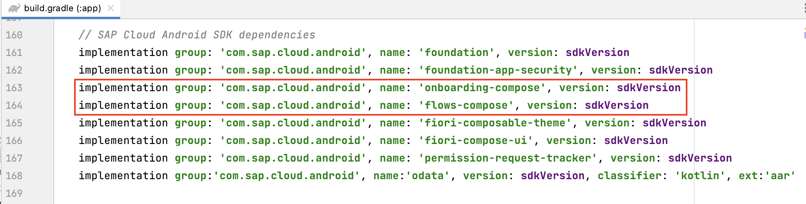
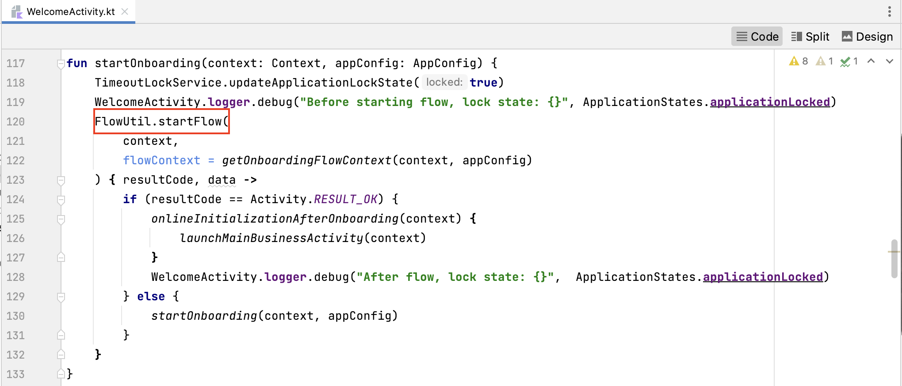
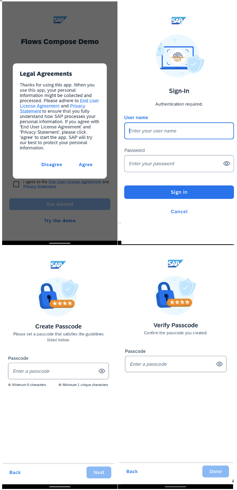

## Prerequisites
- You have [Set Up a BTP Account for Tutorials](group.btp-setup). Follow the instructions to get an account, and then to set up entitlements and service instances for the following BTP services.
    - **SAP Mobile Services**
- You completed [Try Out the SAP BTP SDK Wizard for Android](sdk-android-wizard-app).

## Details
### You will learn
  - How to import Jetpack Compose Flows component into the application project
  - How Jetpack Compose Flows APIs are used in wizard-generated applications
  - Which screens are provided by the Jetpack Compose Flows component

The [Jetpack Compose Flows](https://help.sap.com/doc/f53c64b93e5140918d676b927a3cd65b/Cloud/en-US/docs-en/guides/features/onboarding/android/compose-flows/Overview.html#introduction) component is a new feature of the SAP BTP SDK for Android as of version 6.0. Compared to the view-based version of Flows, the Compose version has the same concept and functionality, so your current project structure does not require any changes. We have also made some enhancements to make it more flexible and easy to use. See [Jetpack Compose Flows Component of SAP BTP SDK for Android](https://community.sap.com/t5/technology-blogs-by-sap/jetpack-compose-flows-component-of-sap-btp-sdk-for-android/ba-p/13552191) for an overview.

---

[ACCORDION-BEGIN [Step 1: ](Examine the dependencies of the Jetpack Compose Flows component)]

1.  Open the project you previously created using the SAP BTP SDK Wizard for Android.

2.  Press **`Shift`** twice and type **`build.gradle`** to open the `build.gradle` file of the app module.

3.  Go to the `dependencies` section and find the dependency declaration for the Compose version of Flows. **`onboarding-compose`** contains the UI screens and **`flows-compose`** contains the Compose version of the Flows API and logic.

    !

[ACCORDION-END]

[ACCORDION-BEGIN [Step 2: ](Explore the usage of the Compose version of Flows API in a wizard-generated application)]

1.  Open the project you previously created using the SAP BTP SDK Wizard for Android.

2.  In Android Studio, on Windows, press **`Ctrl+N`**, or, on a Mac, press **`command+O`**, and type **`WelcomeActivity`** to open `WelcomeActivity.kt`.

3.  On Windows, press **`Ctrl+F12`**, or, on a Mac, press **`command+F12`**, and type **`startFlow`** to move to the `startOnboarding` method. To start the onboarding process, firstly create a **`FlowContext`** instance that contains the information required by the flow, such as the application information, customized screen settings, the flow state listener, etc. Then call the `startFlow` method of the `FlowUtil` class to start the onboarding flow. Compared to the view-based Flows, the 'callback' function has only two arguments, not three as in the view-based Flows. The first argument is the result code, which could be either RESULT_OK or RESULT_CANCEL, the second one is a 'data' intent.

    !

    Notice that by default, the type of a flow is **`FlowType.ONBOARDING`**. To start a different type of flow, such as a `Change Passcode` flow, the client code must specify the flow type in the **`FlowContext`** instance. Besides the parameters specified above, there are also many other parameters in the **`FlowContext`** class that can be modified to allow the client code to customize a flow. When the values of the parameters are not specified in the client code, the default values will be used. The details of all parameters in the **`FlowContext`** class will be explained in subsequent tutorials.

4.  **`FlowStateListener`** is a parameter in the **`FlowContext`** class. In Android Studio, on Windows, press **`Ctrl+N`**, or, on a Mac, press **`command+O`**, and type **`WizardFlowStateListener`** to open `WizardFlowStateListener.kt`. This class is a sample implementation for the callbacks defined in the **`FlowStateListener`** class. The callback functions in 'FlowStateListener' and the execution sequences are the same as in view-based Flows, but all of them are marked 'suspend' in the Compose version of Flows. This will make the client code easier to execute logic in different Dispatchers, and also make the execution sequence easier to manage. The details of **`FlowState`** and **`FlowStateListener`** will be explained in subsequent tutorials.

[ACCORDION-END]

[ACCORDION-BEGIN [Step 3: ](UI screens of the Flows component in a wizard-generated application)]

1.  The Jetpack Compose Flows component provides the required UI screens for the onboarding process and passcode management, including the end user license agreement (EULA) screen for the user to understand and agree to the terms of using the app, the  QR scan screen to get the application configuration, the sign-in screen for user authentication, and passcode screens for the user to create and confirm their passcode. Compared with the view-based Flows, the UI design is the same, but all the screens are implemented using Android Jetpack Compose.

2.  There are different combinations of the screens depending on the different application configuration and user options in the **`FlowContext`** instance. The following are some screenshots in the onboarding process of the project previously generated by the wizard. The details for how to customize the screens and include or exclude a screen in a flow will be explained in subsequent tutorials.

    

Congratulations! You now understand the basic concepts of the Jetpack Compose Flows component and have examined its usage in the project created using the SAP BTP SDK Wizard for Android!

[ACCORDION-END]
