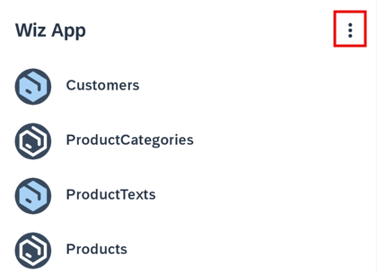
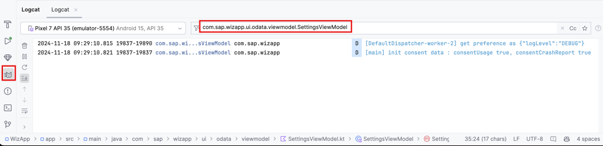
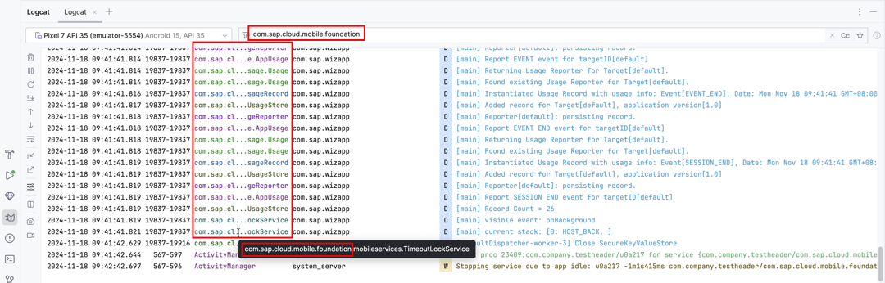
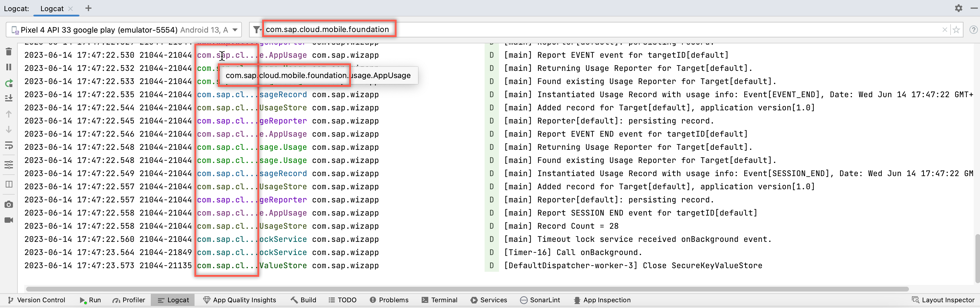
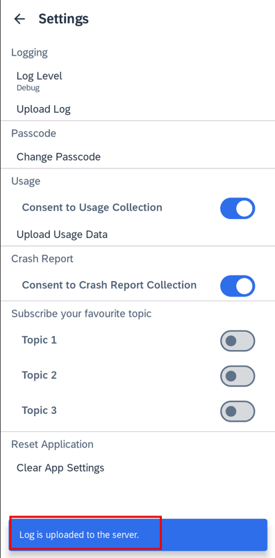
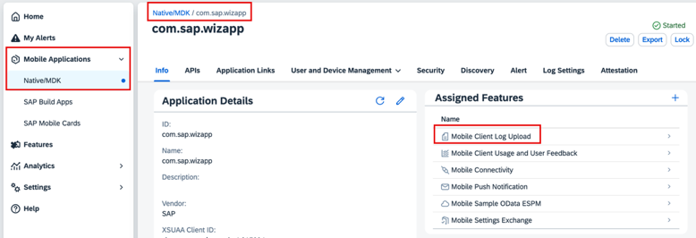
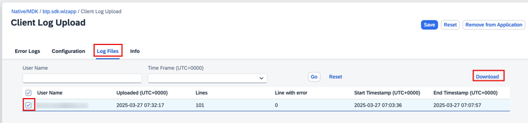
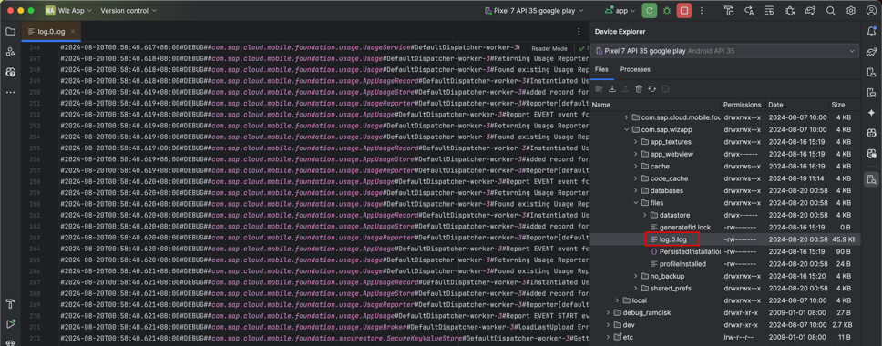
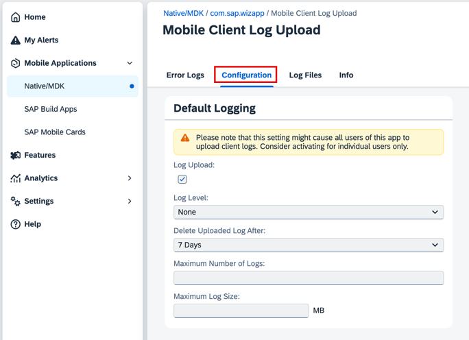
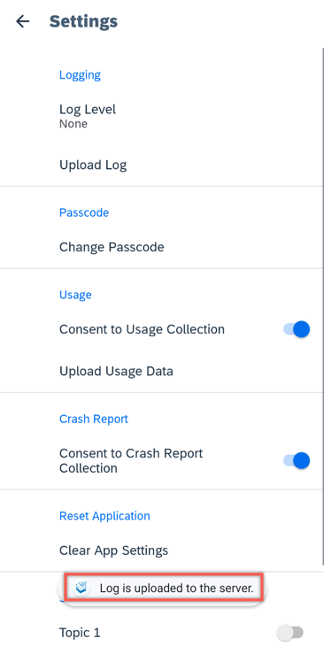

# See How Logging Can Be Used in Your Android Application
<!-- description --> Explore how the logging component can help make deployed applications more supportable.

## Prerequisites
- You have [Set Up a BTP Account for Tutorials](group.btp-setup). Follow the instructions to get an account, and then to set up entitlements and service instances for the following BTP services.
    - **SAP Mobile Services**
- You completed [Try Out the SAP BTP SDK Wizard for Android](sdk-android-wizard-app).

## You will learn
- How to use the Logging component to log messages
- How to change the log level
- How to upload and view logs in the SAP Mobile Services cockpit

---

### Use the logging component

[OPTION BEGIN [Jetpack Compose-based UI]]

1.  In Android Studio, on Windows, press **`Ctrl+N`**, or on a Mac, press **`command+O`**, and enter **`SettingsViewModel`** to open `SettingsViewModel.kt`.

2.  On Windows, press **`Ctrl+F`**, or on a Mac, press **`command+F`**, and enter **`init`** to navigate to the `init` block.

    Note that the following code block contains two logger statements:

    ```Kotlin
    init {
        //init from shared preference
        viewModelScope.launch(Dispatchers.Default) {
            preferencesFlow.collect { userReference ->
                logger.debug("get preference as {}", userReference.logSetting)
                _settingUIState.update { uiState ->
                    uiState.copy(level = LogPolicy.getLogLevel(userReference.logSetting))
                }
            }
        }

        val consentUsage = UserSecureStoreDelegate.getInstance().getConsentStatus(ConsentType.USAGE)
        val consentCrashReport =
            UserSecureStoreDelegate.getInstance().getConsentStatus(ConsentType.CRASH_REPORT)
        logger.debug(
            "init consent data : consentUsage {}, consentCrashReport {}",
            consentUsage,
            consentCrashReport
        )

        ... ...
    ```

    These messages will be logged when the app's log level is set to **Debug** or **Path** and the app's **Settings** menu item is opened.

[OPTION END]

[OPTION BEGIN [View-based UI]]

1.  In Android Studio, on Windows, press **`Ctrl+N`**, or on a Mac, press **`command+O`**, and enter **`EntitySetListActivity`** to open `EntitySetListActivity.kt`.

2.  On Windows, press **`Ctrl+F12`**, or on a Mac, press **`command+F12`**, and enter **`onOptionsItemSelected`** to navigate to the `onOptionsItemSelected` method.

    Note that the following method contains two LOGGER statements:

    ```Kotlin
    override fun onOptionsItemSelected(item: MenuItem): Boolean {
        LOGGER.debug("onOptionsItemSelected: " + item.title)
        return when (item.itemId) {
            R.id.menu_settings -> {
                LOGGER.debug("settings screen menu item selected.")
                Intent(this, SettingsActivity::class.java).also {
                    this.startActivity(it)
                }
                true
            }
    ```

    These messages will be logged when the app's log level is set to **Debug** or **Path** and the app's **Settings** menu item is opened.

[OPTION END]


### Change the log level

[OPTION BEGIN [Jetpack Compose-based UI]]

1.  Navigate to the entity list screen and open the app's menu.

    

2.  Choose **Settings**.

3.  Select **Log Level** displayed in **Logging** on the **Settings** screen.

4.  Set the level to **Debug**.

5.  Navigate back to the entity list screen, then back into the **Settings** screen to see the effect of changing the log level.

6.  Examine the **Logcat** (located at the bottom of the Android Studio screen, click it and you can see the logs). In the filter, add the name of the class that we are interested in seeing the log from: **`com.sap.wizapp.ui.odata.viewmodel.SettingsViewModel`**.

    Notice that the messages were logged since the log level of the app was set to **Debug** or **Path**.

    

---

The SDK libraries also log output based on the app's log level.

1.  Change the filter to **`com.sap.cloud.mobile.foundation`**.

2.  Press **Back** to exit the app and you will see the logged lines from the foundation library.

    

[OPTION END]

[OPTION BEGIN [View-based UI]]

1.  Navigate to the entity list screen and open the app's menu.

    

2.  Choose **Settings**.

3.  Select **Log Level** displayed in **Logging** on the **Settings** screen.

4.  Set the level to **Debug**.

5.  Navigate back to the entity list screen, then back into the **Settings** screen to see the effect of changing the log level.

6.  Examine the **Logcat** (located at the bottom of the Android Studio screen, click it and you can see the logs). In the filter, add the name of the class that we are interested in seeing the log from: **`com.sap.wizapp.mdui.EntitySetListActivity`**.

    Notice that the messages were logged since the log level of the app was set to **Debug** or **Path**.

    

---

The SDK libraries also log output based on the app's log level.

1.  Change the filter to **`com.sap.cloud.mobile.foundation`**.

2.  Press **Back** to exit the app and you will see the logged lines from the foundation library.

    

[OPTION END]


### Upload and view the log

[OPTION BEGIN [Jetpack Compose-based UI]]

1.  Navigate back to the **Settings** screen in the app, and this time tap **Upload Log** right below **Log Level**.

    A Toast message is displayed confirming that the upload succeeded.

    

2.  In the **Mobile Services cockpit**, navigate to **Mobile Applications** > **Native/MDK** > **btp.sdk.wizapp** > **Client Log Upload**.

    

3.  Select the **Error Logs** tab and you will see the log you just uploaded in the **Error** level list. If the log doesn't appear immediately, wait for a few moments, then click **Go** to refresh the view.

4.  You can inspect the log details in the browser by clicking on its table entry.

5.  Select the **Log Files** tab and you will see the log files you just uploaded in the list. You can download the files by clicking **Download**.

    

6.  Additionally, you can access the logs locally on an emulator. You can browse the file system of an Android emulator using the **Device Explorer** to view the log files as shown below: **data** > **data** > **com.sap.wizapp** (or the package name of your project) > **files**.

    

7.  You can manage the initial log level of the application and the ability for mobile services to accept logs on the **Configuration** page, as shown below.

    

[OPTION END]

[OPTION BEGIN [View-based UI]]

1.  Navigate back to the **Settings** menu in the app, and this time tap **Upload Log** right below **Log Level**.

    A Toast message is displayed confirming that the upload succeeded.

    

2.  In the **Mobile Services cockpit**, navigate to **Mobile Applications** > **Native/MDK** > **btp.sdk.wizapp** > **Client Log Upload**.

    

3.  Select the **Error Logs** tab and you will see the log you just uploaded in the **Error** level list. If the log doesn't appear immediately, wait for a few moments, then click **Go** to refresh the view.

4.  You can inspect the log details in the browser by clicking on its table entry.

5.  Select the **Log Files** tab and you will see the log files you just uploaded in the list. You can download the files by clicking **Download**.

    

6.  Additionally, you can access the logs locally on an emulator. You can browse the file system of an Android emulator using the **Device Explorer** to view the log files as shown below: **data** > **data** > **com.sap.wizapp** (or the package name of your project) > **files**.

    

7.  You can manage the initial log level of the application and the ability for mobile services to accept logs on the **Configuration** page, as shown below.

    

[OPTION END]

>For further information on logging, see [Logging](https://help.sap.com/doc/f53c64b93e5140918d676b927a3cd65b/Cloud/en-US/docs-en/guides/features/logging/overview.html).

Congratulations! You have explored how you can use the logging feature to debug or support a deployed application.


---
