# Try Out the SAP BTP SDK Wizard for Android
<!-- description --> Use the Android Studio-integrated SAP BTP SDK Wizard for Android to create a mobile app and configure it to make use of SAP Mobile Services features.

## Prerequisites
- You have [Set Up a BTP Account for Tutorials](group.btp-setup). Follow the instructions to get an account, and then to set up entitlements and service instances for the following BTP services. (To just complete this tutorial mission (except tutorial 7 about translation hub), it's sufficient to simply [Get a Free Account on SAP BTP Trial](hcp-create-trial-account).)
    - **Mobile Services**
- Make sure you can [Access SAP Mobile Services](fiori-ios-hcpms-setup).
- Installed [Android Studio Koala 2024.1.1](https://developer.android.com/studio/archive). Please use the specified version.
- [Downloaded](https://developers.sap.com/trials-downloads.html?search=sdk%20for%20android) and [Installed](https://help.sap.com/doc/f53c64b93e5140918d676b927a3cd65b/Cloud/en-US/docs-en/guides/getting-started/android/setup.html) version 24.8.x or higher of the SAP BTP SDK for Android.
- Created a Google account.

## You will learn
- How to create and run an Android app using the wizard
- How to use Google Firebase to enable push notifications when generating an Android app using the wizard
- Which screens are generated by the wizard

---

### Create the project

>Please read **Prerequisites** first.

1.  Open **Android Studio**.

2.  Choose **New SAP BTP Android App**

    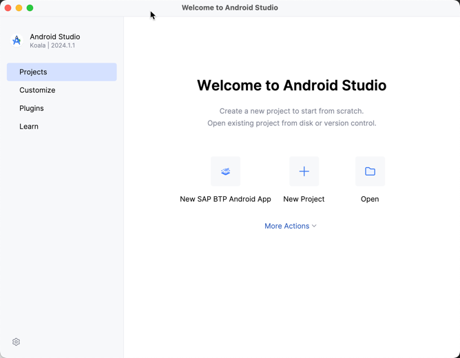

3.  The wizard can save server connection details for multiple servers. Fill in the required fields as shown below.

    | Field | Value |
    |:----|:----|
    | Account Name | **`SAP Mobile Services`** |
    | Admin API URL | **`See below for how to get this URL`** |
    | Admin UI URL | **`See below for how to get this URL`** |
    | Authentication Type | **`Basic`** |
    | Username | **`Username for your account`** |
    | Password | **`Password for your account`** |
    | Save Account Information | **`Check this so that you do not have to re-enter account information on subsequent runs of the wizard`** |

4.  Go to the **SAP Mobile Services cockpit** and under **Important Links**, both Admin URLs are present and can be copied.

    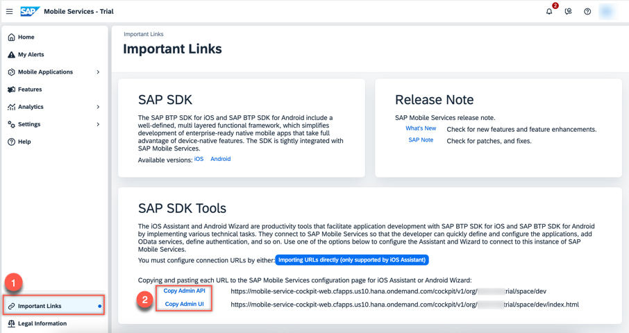

    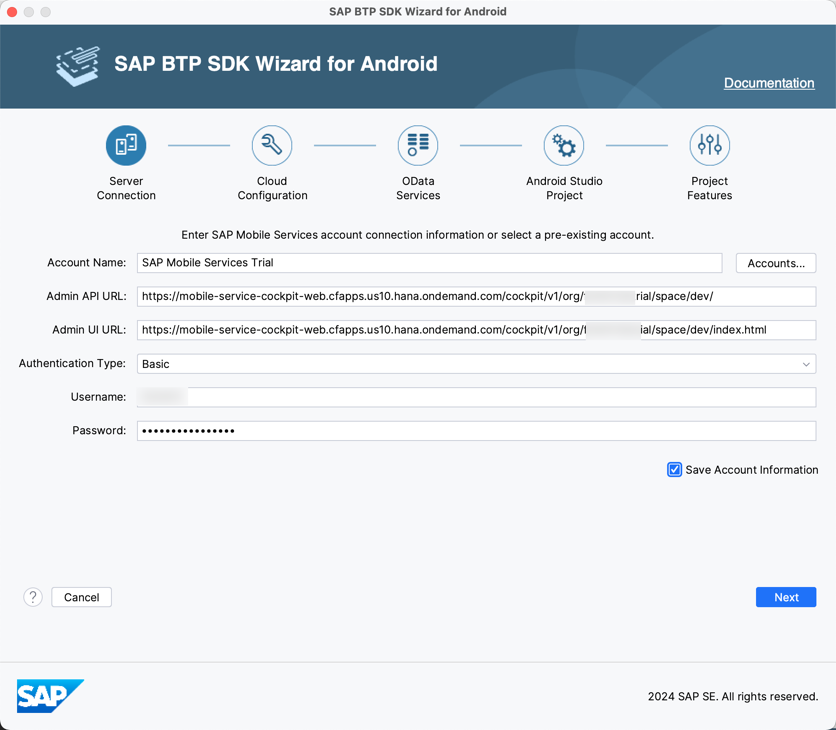

5.  Click **Next** in the **Server Connection** screen.

6.  Select **Sample** in the **Cloud Configuration** screen and set the **Application ID** to **`com.sap.wizapp`**.

    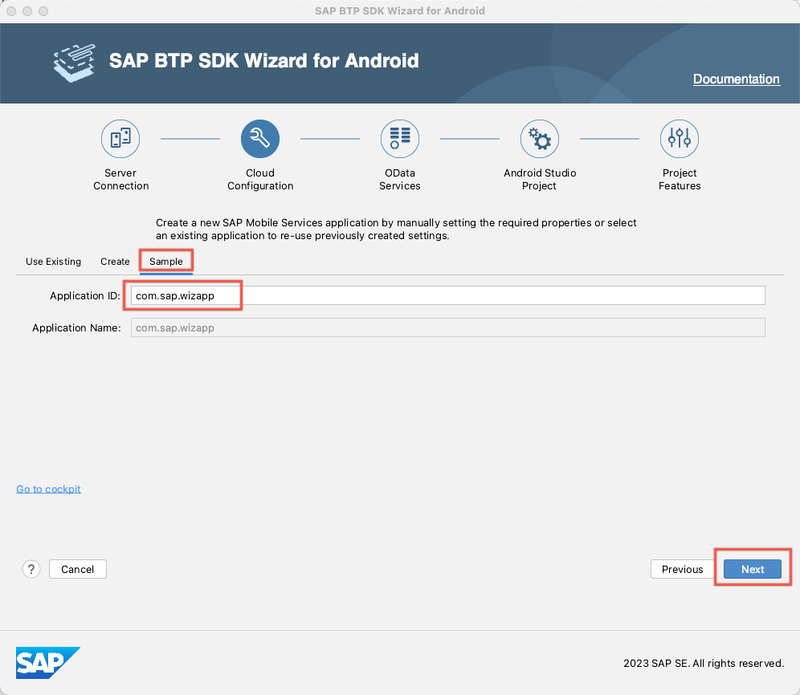

7.  SAP Mobile Services provides a sample back-end destination called `com.sap.edm.sampleservice.v2`, which is used here to provide data for the application. It includes product categories, products, suppliers, customers and sales order data. Select it and click **Next**.

    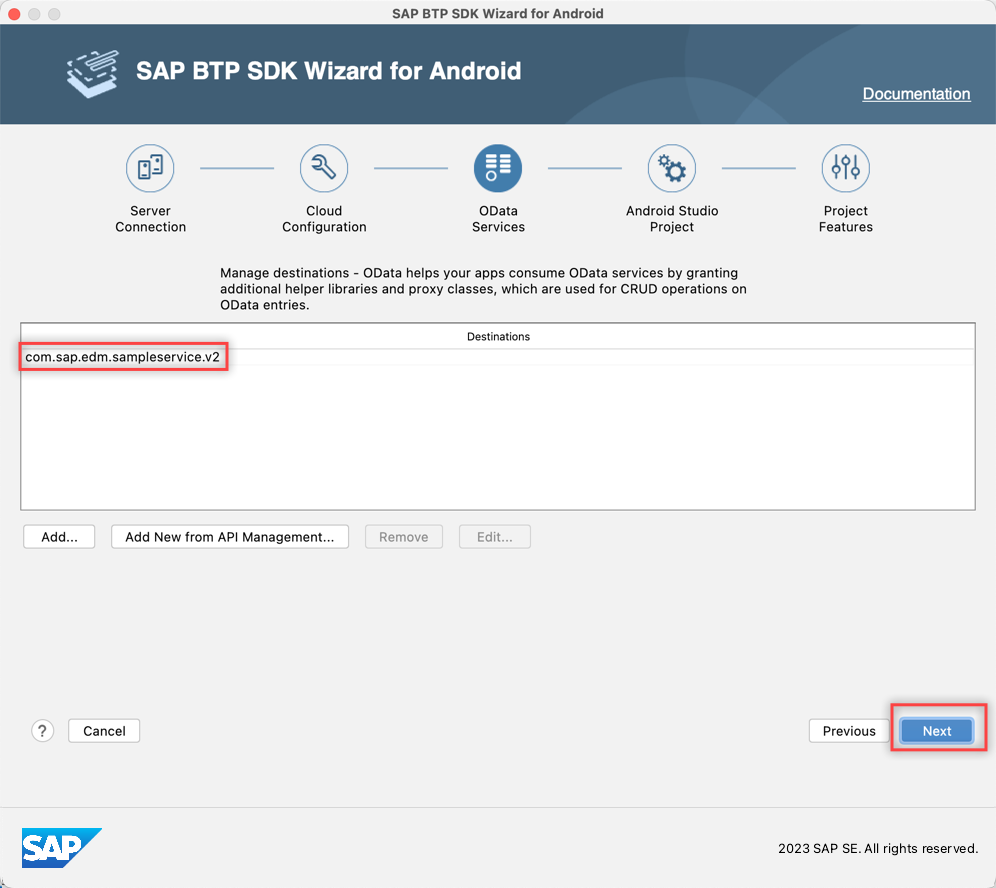

8.  Provide the following configuration data in the **Android Studio Project** screen.

    | Field | Value |
    |:----|:----|
    | Project Name | **`Wiz App`** |
    | Project Namespace | **`com.sap.wizapp`** |
    | UI Framework | **`View-based UI`** / **`Jetpack Compose-based UI`** |

    

9.  Provide the following configuration data in the **Project Features** screen.

    | Field | Value |
    |:----|:----|
    | Enable Multiple Users | **`uncheck`** |
    | Activation Options | **`Generate AppConfig.json`** |
    | OData | **`Online`** |
    | Create a Sample User Experience for the Selected OData Destination | **`check`** |
    | Enable Logging | **`check`** |
    | Enable Upload | **`check`** |
    | Enable Usage Reporting | **`check`** |
    | Enable Crash Reporting | **`optional`** |
    | Enable Push | **`optional`** |

    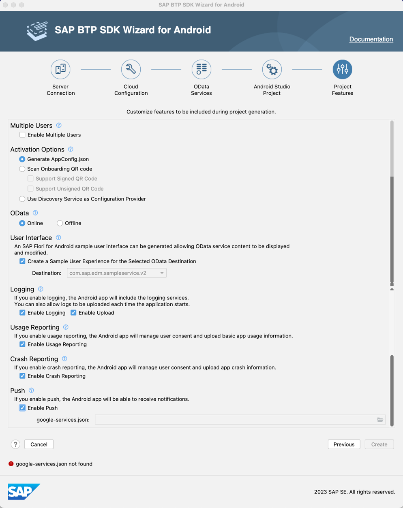

10.  If you would like to add push notification support to your app, proceed to **Step 2**, which describes how to acquire the `google-services.json` file required for cloud messaging. Otherwise, uncheck **Enable Push**, click **Finish** and proceed to **Step 3**.

### Enable push notifications

If you check the **Enable Push** checkbox, an error message will appear, indicating that you need to specify a `google-services.json` file. We will obtain this file from the [Cloud Messaging](https://firebase.google.com/docs/cloud-messaging/) feature in [Google Firebase](https://firebase.google.com/).

1.  Open the [Firebase](https://console.firebase.google.com/) console and click **Create project**. (If you have created any before, click **Add project**.)

    

2.  Click **Continue** until a new project is successfully created.

3.  Navigate to the **Project settings** for the newly created project.

    

4.  Scroll down and add a Firebase to your app.

    

    The **Android package name** must match the **Project Namespace** you used to create the app in Android Studio. In our example, the **Android package name** is **`com.sap.wizapp`**.

    

5.  Download the `google-services.json` file.

    

6.  Now browse for the `google-services.json` file in the wizard. This file is located in the generated project's app folder, enabling the app to work with Google Firebase notifications.

    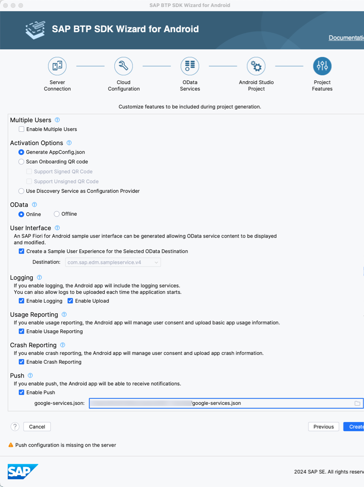

    >You can add push configuration on the server as in the [Send Notifications to Your Android Application](sdk-android-wizard-app-push) tutorial.

7.  Click **Create** and proceed to **Step 3**.

### Explore the app

1.  Wait for the build to finish.

    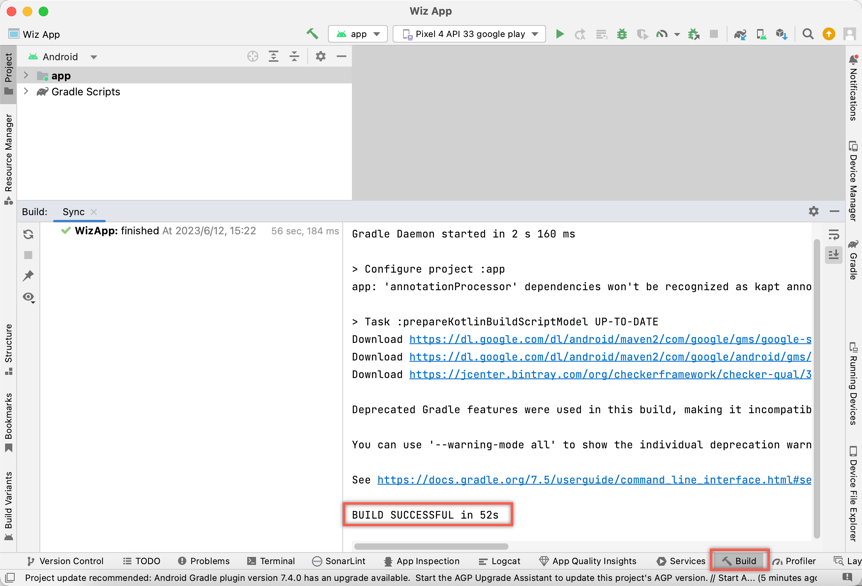

    >You may encounter a build error similar to: "Could not resolve all files for configuration ':classpath'......", open **Preferences** (Windows: **Settings**, Mac: **Android Studio > Settings...**) to change `gradle jdk` to 17.
    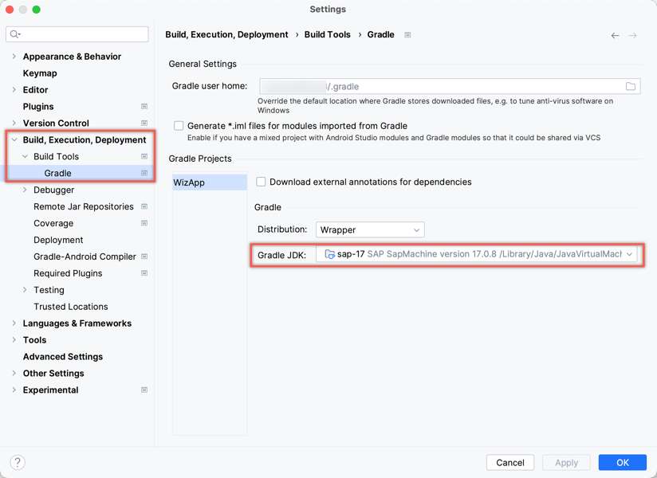

    >Finally, sync the project with the gradle files.
    

2.  Choose an emulator for running the app.
    >If you enabled the push service, please ensure you install an emulator with the **Target** labeled as **Google Play**. For more information on creating virtual devices that run in the Android Emulator, see [Create and manage virtual devices](https://developer.android.com/studio/run/managing-avds) in the Android Studio User Guide.

    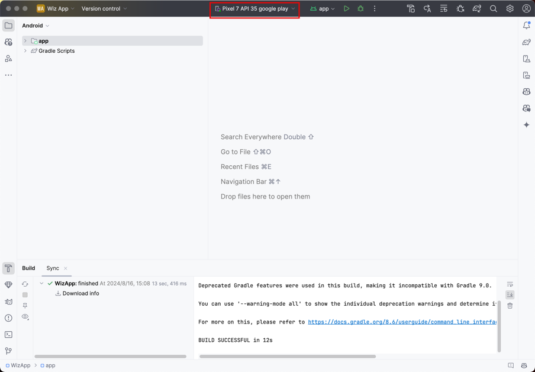

3.  Click the **Run** toolbar icon.

    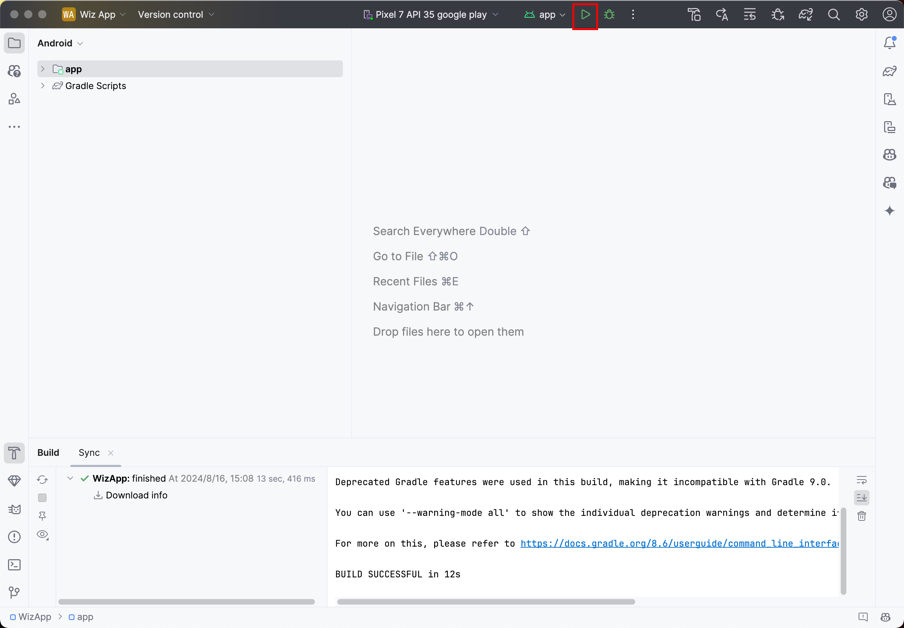

    The welcome screen is displayed the first time the app is launched.

    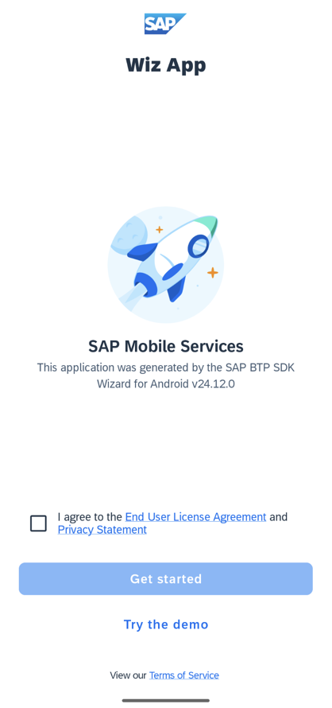

4.  Check the agreement, click **Get Started**, and the sign-in screen is displayed. Log in with your username and password.

    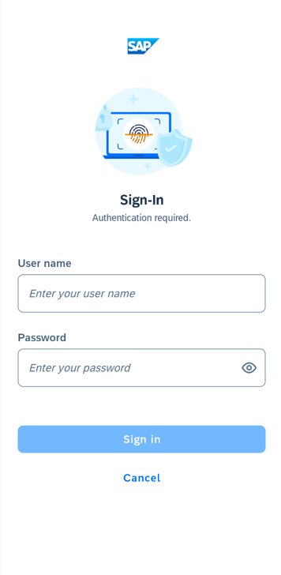

    The credentials you enter are securely stored by the app, and do not need to be re-entered the next time you open the app.

    The passcode (or fingerprint if enabled) screen provides an additional layer of security for your app.

    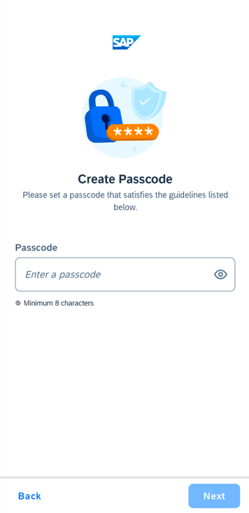

5.  You can modify the passcode policy in the [Mobile Service Cockpit](https://mobile-service-cockpit-web.cfapps.eu10.hana.ondemand.com/) under **Client Configuration** in **Mobile Settings Exchange** page. The passcode screen will not be displayed if the **Enable Passcode Policy** is not checked.

    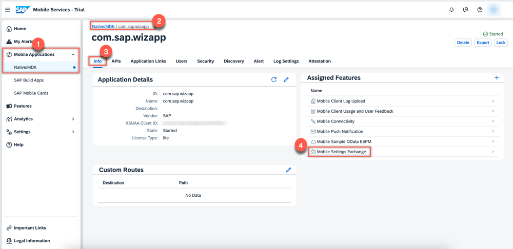

    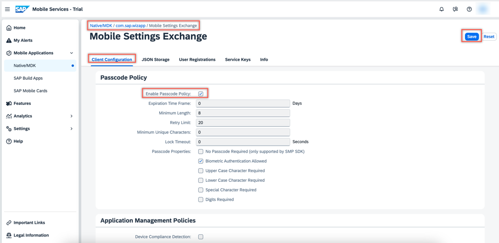

6.  **Enable Usage Reporting** is checked, this screen can display details about how the collected data will be utilized. For now, select either **Allow** or **Deny**. **Usage Reporting** is covered in another tutorial in this mission.

    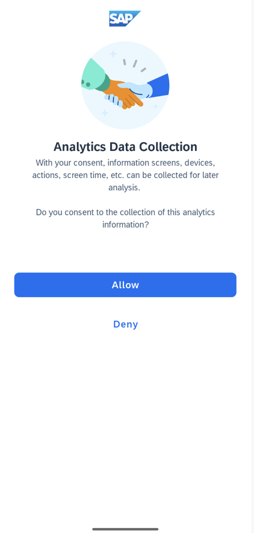

7.  Similar to `Usage Reporting`, if **Enable Crash Reporting** is checked, this screen will show details about how the collected information will be used. Choose either **Allow** or **Deny**. If you select **Deny**, the crash information will only be stored locally.

    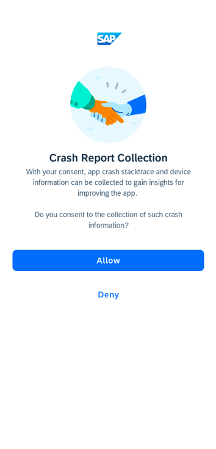

8.  Click **Next** on the **Allow Notifications** screen to choose either **Allow** or **Don't allow** to indicate whether you want the app to send you notifications.

9.  The first screen of the app displays various entities that are available in the sample OData service.

    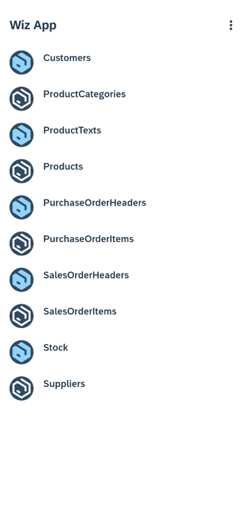

    Tap **Products** to navigate to the products list.

    

10. Tap a list item to display the following editable detail screen.

    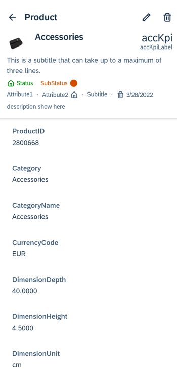

>For further information on generating your app, see [Creating Apps with the Wizard](https://help.sap.com/doc/f53c64b93e5140918d676b927a3cd65b/Cloud/en-US/docs-en/guides/getting-started/android/creating-an-app.html).

Congratulations! You have created your first Android app using the SAP BTP SDK Wizard for Android!

---
